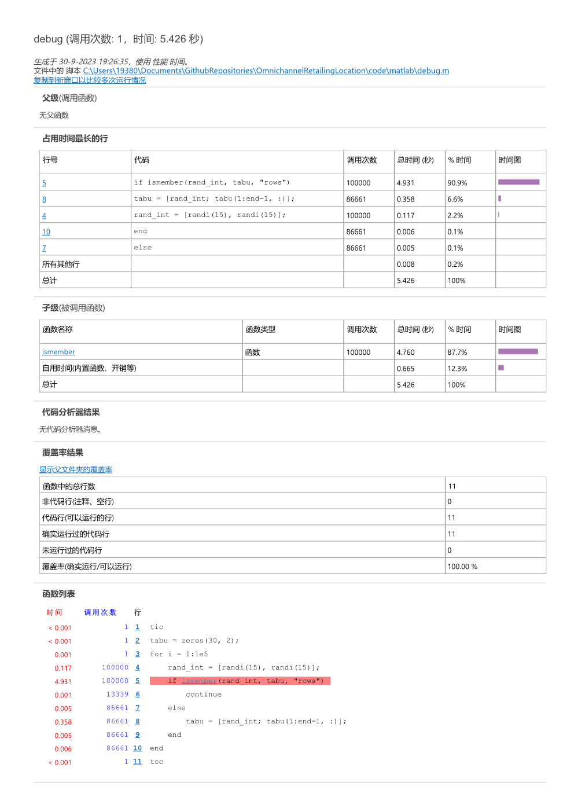
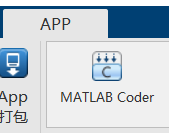
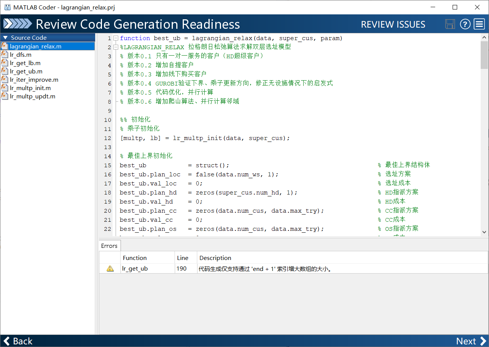
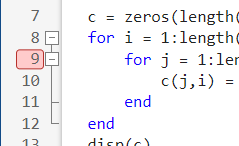
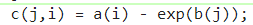
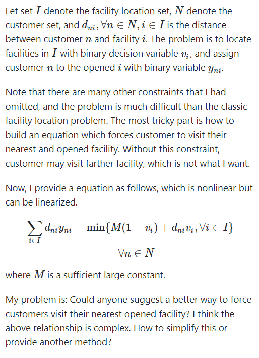

记录在学校的一次matlab课上的技术分享。

**前言**：本次分享主要内容是介绍一些常用的技术，目的是让大家了解遇到某种编程需求该怎么做，用什么方法解决什么问题。

**假设**：各位已经掌握matlab的基本方法，并且自己也会写一些简单代码了。


# 1. 代码优化

**Q：为什么我的代码这么慢？**

**A：解释型语言就是比编译型语言慢 + 代码未优化**

## 1. 1 预分配内存

在进行循环语句时，应当先声明变量所需空间的大小，再进行循环，避免每次循环向数组中增加数字。

**不推荐写法**

```matlab
tic
for i = 1:1000
	mat(i,i) = i;
end
toc
% 历时 0.115061 秒。
```

**推荐写法**

```matlab
tic
mat_2 = zeros(1000); % 先把数组的大小声明，在内存中开辟一块空间
for i = 1:1000
	mat_2(i,i) = i;
end
toc
% 历时 0.005585 秒。
```

**为什么出现这样的差异？**

反复调整数组的大小将导致花费额外的时间找到更大的、**连续的**内存空间。

**所有类型的变量都需要这样做吗**

不一定，cell类型则不需要，但是放在cell中的数据类型可能需要。cell数组内存不连续，但是每个cell要求连续内存。（这也是看情况的，cell在编译成mex文件时，同样需要初始化内存）

参考链接：

https://ww2.mathworks.cn/help/matlab/matlab_prog/preallocating-arrays.html

https://ww2.mathworks.cn/help/matlab/matlab_prog/techniques-for-improving-performance.html

https://ww2.mathworks.cn/help/matlab/matlab_prog/avoid-unnecessary-copies-of-data.html

https://ww2.mathworks.cn/help/matlab/matlab_prog/strategies-for-efficient-use-of-memory.html


## 1. 2 向量化

官方定义：

> 修正基于循环且面向标量的代码以使用 MATLAB 矩阵和向量运算的过程称为***向量化***。

简单来说，就是替代for循环做一些简单操作，以提高运行速度、可读性、正确性。即，算法流程控制`for`循环，简单操作向量化。

**向量化是matlab的一个重要特点，这在其他语言很少出现**

向量化的语句通常有底层的支持，利用到了CPU指令集进行优化，因此速度较快。

for循环遍历慢的原因是matlab为解释性语言。

### 求1至10000的每个数的正弦的和

**循环写法：**

```matlab
tic
all_sum = 0;
for i = 1:1e4
	all_sum = all_sum + sin(i);
end
disp(['all_sum: ', num2str(all_sum)])
toc
% all_sum: 1.6339
% 历时 0.038938 秒。
```

**向量化写法：**

```matlab
tic
all_sum = sum(sin(1:1e4));
disp(['all_sum: ', num2str(all_sum)])
toc
% all_sum: 1.6339
% 历时 0.008211 秒。
```

为什么`all_sum`这么小？

### 隐式扩展，求每个人每科成绩与平均值的差距

```matlab
% 每个人有三门课，
A = [97 89 84; 
     95 82 92; 
     64 80 99;
     76 77 67;
     88 59 74; 
     78 66 87; 
     55 93 85];		% 每一列是一个人
```

**循环写法**

```matlab
mA = mean(A);			% 求每列的平均值
B = zeros(size(A));		% 记录每个人每门课的差距
for n = 1:size(A,2)		% 对每一列进行操作
    B(:,n) = A(:,n) - mA(n);
end
```

**向量化写法**

```
devA = A - mean(A)
```

注意，在向量化写法中，`mean(A)`的结果是1c 3大小的。即使 `A` 是一个 7×3 矩阵，`mean(A)` 是一个 1×3 向量，MATLAB 也会隐式扩展该向量，就好像其大小与矩阵相同一样，并且该运算将作为正常的按元素减法运算来执行。（广播操作）

### 逻辑索引，线性索引，下标索引

**介绍三种索引方式的区别**

一个矩阵A ，寻找这个矩阵中大于500的数字的行列数

**循环方法**（单个循环，获得线性索引，双层循环，获得行列数）

```matlab
A = magic(100);
tic
sub = zeros(sum(A>500, 'all'), 2);
count = 1;
for i = 1:100
	for j = 1:100
		if A(i,j) > 500
			sub(count,:) = [i,j];
			count = count + 1;
		end
	end
end
toc
```

**find方法**

```
A = magic(100);
tic
[row, col] = find(A>500);
sub = [row, col];
toc
```

**处处用find真的合适吗？**

求矩阵A中，所有大于500的数的和

`sum(A(find(A>500)))`线性索引
<!-- ../images/20240712/image-20231001192302431.png -->


`sum(A>500))`这里直接使用了逻辑索引

**注意：在for循环中，尽量不用注意：在for 循环中，尽量不用find，有些慢。如果不得不使用for获取满足条件的索引，先记录线性索引，然后用ind2sub()函数转化**

### 重复数组

根据向量、矩阵创造大的矩阵

```matlab
A = repmat(1:3,5,2)
B = repmat([1 2; 3 4],2,2)

% A =

%     1     2     3     1     2     3
%     1     2     3     1     2     3
%     1     2     3     1     2     3
%     1     2     3     1     2     3
%     1     2     3     1     2     3


% B =

%     1     2     1     2
%     3     4     3     4
%     1     2     1     2
%     3     4     3     4
```

思考题：多个等间隔指针的轮盘赌如何向量化（随机遍历抽样，遗传算法中经常使用的一个选择方法）？

参考链接：https://ww2.mathworks.cn/help/matlab/matlab_prog/vectorization.html

## 1. 3 冗余运算

消除for循环中的冗余运算有助于提升算法的性能。能放到外层的，就放到外层。

给定一个矩阵A，要求A的每个数乘以当前行数，在加上当前列数，再加一个固定的数

```matlab
for i = 1:size(A, 1) % 行
	for j = 1:size(A, 2)
		fix = 1;
		tmp = A(i,j);
		tmp = tmp * i + j;
		A(i,j) = tmp + fix;
	end
end

%%%%%%%%%%%%%%%%%%%%%%%%%%%%%%%%%%
% fix 提出
fix = 1;
for i = 1:size(A, 1) % 行
	for j = 1:size(A, 2)
		tmp = A(i,j);
		tmp = tmp * i + j;
		A(i,j) = tmp + fix;
	end
end

%%%%%%%%%%%%%%%%%%%%%%%%%%%%%%%%%

fix = 1;
for i = 1:size(A, 1) % 行
	A(i,:) = A(i,:) * i;
	for j = 1:size(A, 2)
		A(i,j) = A(i,j) + j + fix;
	end
end

%%%%%%%%%%%%%%%%%%%%%%%%%%%%%%%%%
% 向量化
A = (1:size(A, 1))' .* A + (1:size(A, 2)) + fix
```


## 1. 4 性能分析

**我的代码怎么这么慢？想改，改什么呢？**

这个时候，需要使用探查器进行代码性能分析

比如对debug.m脚本（模拟禁忌搜索的过程）进行性能分析：

```matlab
% debug.m
% 模拟禁忌搜索的过程
tic
tabu = zeros(30, 2);
for i = 1:1e5
    rand_int = [randi(15), randi(15)];
    if ismember(rand_int, tabu, "rows")
        continue
    else
        tabu = [rand_int; tabu(1:end-1, :)];
    end
end
toc
```

**Step 1. 打开探查器**


**Step 2. 在探查器中运行代码**


**Step 3. 点击函数名称 获得具体情况**



发现原来是`ismember`函数运行太慢了，所以根据问题特性，我们自己写一个`my_ismember`函数，替换原有的`ismember`函数。

原`ismember`函数耗时4.931秒，自己写的`my_ismember`函数耗时0.937秒。


上述例子说明：

- 不一定内置函数就足够好，一些函数内置函数为了支持各种数据类型、大小，还是很慢的

- 根据问题、数据结果特征进行重构

  ```matlab
  function flag = my_ismember(a, b)
  % 判断a是否在b中
  
  validateattributes(a, {'numeric'}, {'size',[1,2]})
  validateattributes(b, {'numeric'}, {'size',[nan,2]})
  
  col_1_flag = b(:, 1) == a(1);
  col_2_flag = b(:, 2) == a(2);
  
  if any(col_1_flag & col_2_flag)
      flag = true;
  else
      flag = false;
  end
  end
  ```

  **注意：** 探查器中运行的代码速度包括了统计时间，因此比一般方式下运行更慢。
  
  参考：https://www.mathworks.com/help/releases/R2023b/matlab/matlab_prog/profiling-for-improving-performance.html

## 1. 5 使用更具效率的算法

有些时候，真正慢的是使用的算法的复杂度很高（$$O(n^2)$$甚至$$O(n^3)$$, 或者说是算法过于朴素），跟向量化等上述技术无关。这种慢根源于算法的复杂度，解决方法是换个思路重写。

### 双数之和

给定一个整数数组 `nums` 和一个整数目标值 `target`，请你在该数组中找出 **和为目标值** *`target`* 的那 **两个** 整数，并返回它们的数组下标。

```matlab
% 输入：nums = [2,7,11,15], target = 9
% 输出：[0,1]
% 解释：因为 nums[0] + nums[1] == 9 ，返回 [0, 1] 。

% 随机构造
rng(pi);
nums = [2,7,11,15];
rand_num = randperm(5e4) + 20;
nums = [nums, randperm(5e4) + 20];

nums = nums(randperm(length(nums))); % nums长度为50004 
target = 9;

tic
two_sum(nums, target)
toc
% ans =
%       36335       36975
% 历时 4.324590 秒。

tic
two_sum_hash(nums, target)
toc
% ans = 
%       36335       36975
% 历时 0.020854 秒。

%  足足200倍速度差距
```

**暴力枚举（朴素）算法**

```matlab
function output = two_sum(nums, target)
% O(N^2)
len_num = length(nums);
for i = 1:len_num
    for j = 1:len_num
        if i == j
            continue
        end

        if nums(i) + nums(j) == target
            output = [i,j];
            return
        end
    end
end
end
```

**字典 - 空间换时间**

```matlab
function output = two_sum_hash(nums, target)
% 该代码使用了dictionary()， 仅支持2022b以上版本
% O(NlogN)
len_num = length(nums);
d = dictionary(nums, 1:len_num);
for i = 1:len_num
    val_1 = nums(i);
    val_2 = target - val_1;
    if isKey(d, val_2) && d(val_2) ~= i
        output = [d(val_2), i];
    end
end
end
```


# 2. <font color="#dd0000">工具箱</font>

## 2.1 Coder

Matlab和python一样是一门解释性语言，因此运行速度不如编译型语言（C++等），因此一些复杂的函数运行起来相对较慢。

不过，Matlab Coder提供了一种方法，使得我们可以将一个函数编译成C或C++或二进制文件，供Matlab使用。步骤如下：

你需要一个Matlab  Coder工具箱。如果没有，则在附加功能中获取。在顶部APP中打开Coder。




- **进入Select环节**：键入你想编译的函数，注意只能是函数，不能是脚本。这里以`lagrangian_relax`函数为例，然后点击next。
- **进入 review环节**：在这个环节，Coder会检查你的代码有无问题，这个步骤会检查`lagrangian_relax`函数调用的所有函数。

在底部出现了一条警告，此时应注意，警告和错误是不同的，程序可以有警告（前提是已知警告产生的原因和后果），错误则不同。错误将直接导致程序运行不通。

解决完所有问题后，点Next。

- **进入Define环节：**该环节定义了所有变量的类型&大小。

  

  在上方的框中，输入调用`lagrangian_relax`函数的脚本，然后点`Autodefine Input Types`按钮，等程序运行，所有的变量的大小自动确定。**但是**，自动确定的变量大小类型是固定的，也就是说只能输入这种大小的数据，所以，对一些不确定大小的数据，需要手动将大小调整成inf。点Next，继续。

- **进入 check环节**：Coder会运行之前输入的脚本，检查是否有运行问题、编译问题等等。这一步可能会出现各种报错，这些报错的原因并不是`lagrangian_relax`函数的结果有问题，而是写脚本的习惯超出编译器可理解的范围，或者编译器认为写的不严谨，数据类型/大小匹配等一系列问题。需要逐个修改，直至通过编译。


- **进入 generate环节**：如果仅仅想在matlab中调用编译好的二进制文件提升运行速度，那么选择mex即可，点Geneate等待生成。

  

- **完成**
  


接下来，我们就可以像使用一个普通函数一样使用这个mex文件了。

```matlab
tic
lagrangian_relax_mex(data, super_cus, param); % 生成的mex文件
toc
% Iter:  25; LB:    32233.19; UB*:   42478.36; Cons: 2.000000; Gap:  24.12 % 
% LR finish: max iteration
% 历时 3.555206 秒。


tic
lagrangian_relax(data, super_cus, param); % 原来的函数
toc
% Iter:  25; LB:    32233.19; UB*:   42478.36; Cons: 2.000000; Gap:  24.12 % 
% LR finish: max iteration
% 历时 93.820573 秒。
```

可以观察到，两种方法输出的结果是一样的，但是速度差了30倍。

**Coder的缺点：**

- 并不是所有内置函数都支持Coder的，例如dictionary就不支持。不支持的函数会在编译时报错。

- Coder编译的文件来源于选择的C++编译器，很可能出现mex文件在另一台电脑上无法运行的情况。

- Coder编译的文件的另一个问题是不能跨平台，mac/win/linux编译得到的文件时不同的。

参考链接：[通过生成 MEX 函数加快 MATLAB 算法的执行速度](https://ww2.mathworks.cn/help/releases/R2020b/coder/gs/generating-mex-functions-from-matlab-code-at-the-command-line.html)

​					[从 MATLAB 代码生成 C 和 C++ 代码](https://ww2.mathworks.cn/products/matlab-coder.html)

​					[MATLAB Coder入门到放弃](https://zhuanlan.zhihu.com/p/604283307)

​					https://blog.csdn.net/qq_36584460/article/details/110791330	

**（实操环节），编译一个mex文件并运行**


## 2. 2 parallel computing toolbox

前面提到过利用多核心进行并行计算，需要并行计算工具箱。

> 该工具箱通过在本地运行的 worker（MATLAB 计算引擎）上执行应用程序，允许你充分利用多核台式机的处理能力。无需更改代码，即可在集群或云上运行同一个应用程序。还可以将该工具箱与 MATLAB Parallel Server 结合使用，以执行由于太大而无法装入单台机器内存的矩阵计算

### 并行for循环

```matlab
tic
n = 200;
A = 500;
a = zeros(1,n);
for i = 1:n
    a(i) = max(abs(eig(rand(A))));
end
toc
% 历时 37.256415 秒。
```

```matlab
tic
n = 200;
A = 500;
a = zeros(1,n);
parfor i = 1:n
    a(i) = max(abs(eig(rand(A)))); % 最大 / 绝对 / 特征值 / 随机
end
toc
% 历时 8.028954 秒。
```

使用场景：许多简单计算的循环，parfor将循环划分为组，以便每个线程可以执行一组。

**但是，**循环中一组循环的结果依赖前面某次循环的结果时，不能使用并行计算（归约[Reduction Variables](https://ww2.mathworks.cn/help/parallel-computing/reduction-variable.html)除外）。并行计算有一系列局限性，而且在一些情况下（例如，广播变量）并不能加速代码运行。

**使用`parfor`的情况：**

- 每次的for循环很慢（单个时间长）
- 简单计算的多次循环（单个时间短但是数量多）
- 多层for嵌套的外层使用parfor更具收益（**思考：为什么？**）

**不推荐用`parfor`的情况：**

- 已经将for向量化的情况（向量化比parfor收益更高）
- 循环已经很快了（并行化的时间开销更高，包括初始化，分配等）

**强烈反对的情况：**

- 向量化 -> for循环 -> parfor循环 （反向优化）

**`for`转`parfor`的一个不可行举例**


for转parfor一定程度上很复杂，有各式各样的规则限制、写法限制，这里只做一个简单介绍。关于什么时候用parfor，如何将for转为parfor，使用parfor的要求，常见问题等，参见[parfor文档](https://ww2.mathworks.cn/help/parallel-computing/parallel-for-loops-parfor.html?s_tid=CRUX_lftnav)。

参考链接：[在多核计算机、GPU 和集群上执行并行计算](https://ww2.mathworks.cn/products/parallel-computing.html)

**补充：parfor可以和coder结合使用，生成的mex文件也是支持多核计算的**

## 2. 3 Symbolic Math Toolbox

符号计算工具箱，就是能计算数学公式的一个工具箱，变量不再是数值而是符号。因此可以求计算**定积分**和**不定积分**的**解析解**，计算符号表达式或函数的**导数**，并使用级数展开式逼近函数，等等。

例如，求$$ \int_a^b \sin x dx$$在$$[\frac{\pi}{2}, \frac{3\pi}{2}]$$上的积分

```matlab
syms x
int(sin(x),pi/2,3*pi/2)
% ans = 0
```

这只是一个简单的例子，表示我们可以使用matlab做这件事，具体应用：

**某博弈论问题求纳什均衡点**

解方程组：


解得四个解中的一个解为纳什均衡点。


**纳什均衡点$$E_4$$的雅克比矩阵**


**注：符号计算工具箱不支持coder**

如何查看是否支持 coder？详见函数参考文档的底部支持列表

# 3. 技巧经验

## 3. 1 使用结构体进行传参

假设你有一辆车，车长4米，平时跑72km/h，车重1000kg，载重2000kg，现在你写了一个函数`f`用于估计油耗。

```matlab
function consume = f(len, velocity, weight, capacity)
	...
end
```

使用结构体封装一下

```matlab
vehicle = struct()
vehicle.len = 4;
vehicle.velocity = 72;
vehicle.weight = 1000;
vehicle.capacity = 2000;

function consume = f(vehicle)
	...
end
```

包括传出，也可以使用结构体，解决了参数记错的问题。

consume = [1, 2, 3, 4]

consume. air = 1; % 空气阻力产生的燃料消耗

consume.weight = 2; % 重量产生的消耗

...

给名字就不容易错了，比consume(1) consume(2) 这种要方便


## 3.2 使用句柄函数@

### `C = bsxfun(fun,A,B)` 

Binary Singleton Expansion Function

对数组 `A` 和 `B` 应用函数句柄 `fun` 指定的按元素二元运算。

```matlab
A = [8; 17; 20; 24]
B = [0 10 21]
C = bsxfun(@gt,A,B)

% C = 4x3 logical array

%    1   0   0
%    1   1   0
%    1   1   0
%    1   1   1

```

其中`@gt`的意思是大于"greater than"， 因此生成了隐式扩展结果。

接下来，给定一个向量`a`和一个向量`b`，求$$a-e^b$$的所有组合的结果。

```matlab
a = [1 2 3 4];
b = [5; 6; 7];

% 第一种方法
c = zeros(length(b), length(a));
for i = 1:length(a)
	for j = 1:length(b)
		c(j,i) = a(i) - exp(b(j));
	end
end
disp(c)

% 第二种方法
f = @(a, b) a - exp(b);
c = bsxfun(f, a, b);
disp(c)
```

### `A = cellfun(func, C)`

 对元胞数组`C`的每个元胞进行操作。

获取元胞数组中，每个元胞的大小

```matlab
C = cell(3, 1);
C{1,1} = 'Sunday';
C{2,1} = magic(3);
C{3,1} = 1:10;

% 循环操作
A = zeros(size(C, 1), 1);
for i = 1:size(C, 1)
	A(i) = length(C{i,1}(:));
end
disp(A)
% [6; 9; 10]

% cellfun
A = cellfun(@(x) length(x(:)), C)
% [6; 9; 10]

```

### `A = structfun(func, S)`

对标量结构体的每个字段应用函数

```matlab
S.f1 = 1:10;
S.f2 = [2; 4; 6];
S.f3 = []

A = structfun(@mean,S)
% A = 3×1

%     5.5000
%     4.0000
%        NaN
```

## 3. 3 运行日志

将命令行窗口文本记录到日志文件中

```matlab
diary 'myDiaryFile.txt'

for i = 1:10
	disp(exp(i))
end

diary off
```

你就会得到一个`myDiaryFile.txt`文件，用于记录所有打印的结果。

用处：追踪程序运行状况，运行到哪次迭代？运行到哪一步？配合其他函数，还可以记录何时运行等信息。

## 3.4 格式化输出

格式化字符串

```matlab
formatSpec = 'The array is %dx%d.';
A1 = 2;
A2 = 3;
str = sprintf(formatSpec,A1,A2)
% str = 
% 'The array is 2x3.'

fprint(formatSpec,A1,A2)
% 'The array is 2x3.'
```

参考： https://www.mathworks.com/help/releases/R2023b/matlab/matlab_prog/profiling-for-improving-performance.html

有什么用？多次运行一个函数，但是输入参数不同时，配合`diary`函数可生成结果日志


解放双手，从自动运行做起，拒绝**手动保存**每次的运行结果。

## 3.5 运行时间

想要获取运行了多久？使用`tic`和`toc`函数统计代码运行时间。

高级用法：使用多个tic测量时间

```matlab
tStart = tic;           % pair 2: tic
n = 10;
T = zeros(1,n);
for i = 1:n
    A = rand(12000,4400);
    B = rand(12000,4400);
    tic         % pair 1: tic
    C = A.*B;
    T(i)= toc;  % pair 1: toc
end
tMul = sum(T) % tMul = 0.6037
tEnd = toc(tStart) % tEnd = 11.6301
```

其他统计代码运行时长的方法：

[t = cputime](https://ww2.mathworks.cn/help/releases/R2023b/matlab/ref/cputime.html?)

[t = datetime](https://www.mathworks.com/help/releases/R2023b/matlab/ref/datetime.html?searchHighlight=datetime&s_tid=doc_srchtitle#d126e310370)

## 3.6 多层嵌套

看这样一个代码，每月每天你孤单会想起谁：

```matlab
for month = 1:12  % 月
	for day = 1:30 % 天
		if 孤单？
			你想起一个人
			if 想找个人来陪
				找！
			end
		end
	end
end
```

上述代码的问题：嵌套太多了，一层一层的嵌套。（写代码的习惯，不影响执行效率，但是影响可读性）

```matlab
for month = 1:12  % 月
	for day = 1:30 % 天
		if ~ 孤单？ % 非孤单 "~"取反
			continue
		end
		
		你想起一个人
		if 想找个人来陪
			找！
		end
	end
end
```

使用continue关键字跳转，避免嵌套，提升可读性

## 3.7 Latex公式

latex是特别常用且提升效率的公式编辑方法，推荐大家使用！

好处：输入公式时，手不再使用鼠标，全键盘操作

可以使用的场景：

- word
- markdown
- latex
- mathtype
- matlab
- ...

## 3.8 实时脚本做展示

一般不用这个功能做开发，但是实时脚本是良好的展示工具

类似于 python 的 jupyter notebook


## 3.9 数值精度问题

数值精度问题普遍存在于计算机语言中，我们不讨论产生数值精度的具体原因，只需要知道存在这样的问题。

例如：

```matlab
0.1 + 0.2 == 0.3

% ans =

%  logical

%   0

```

在for循环中，需要避免以下的情况

```matlab
for i = 0.0:0.1:1.0
    disp('-------------------')
    for j = 0.0:0.1:1.0-i
        k = 1.0 - i - j;
        disp([i,j,k])
    end
end

% -------------------
%    0.7000         0    0.3000
%    0.7000    0.1000    0.2000
%    0.7000    0.2000    0.1000
%    0.7000    0.3000   -0.0000
```

出现一个非常小的负数，极有可能导致bug

```matlab
for i = 0:10
    disp('-------------------')
    for j = 0:(10-i)
        k = 10 - i - j;
        disp([i,j,k] / 10)
    end
end

-------------------
    0.7000         0    0.3000

    0.7000    0.1000    0.2000

    0.7000    0.2000    0.1000

    0.7000    0.3000         0

```


## 3.10 在线Matlab

电脑没有matlab？只要有许可证，就能使用matlab在线编程（https://ww2.mathworks.cn/products/matlab-online.html）。

## 3.11 Markdown语言

本文档就是使用的markdown编写的，这是一种文本标记语言，实现文本的不同格式、样式。

# 4. 如何DEBUG

## 4.1 断点

调试程序是每个编程语言必备的操作，没有人能完美写完一个复杂的代码并且没有任何小错误。当这些错误直观发现不了时，使用断点追踪程序每步的运算有助于发现问题。



## 4.2 条件断点

例如在这个循环中，每次`j=3`时就报错，我们增加一个条件断点，当满足这个条件时，程序暂停。


## 4.3 错误暂停


建议把出现错误暂停勾选，这样程序会停止在出错的哪一行，有助于分析/复现问题。


## 4.4 搜索问题

当一个问题，自己不能解决的时候，我们通常会使用搜索引擎进行检索，如何获得问题的答案？

例如：

> 我想删除一个cell数组中空的元胞，保留下非空的元胞

一般我会用 “语言 + 关键词 ”搜索

- 搜索方法：`MATLAB cell删除空元胞`

- 结果质量：
  - Matlab中文论坛 / 知乎 / 博客园 
  - CSDN（垃圾堆里找吃的，但不代表都是垃圾） / 简书
  - 百度知道 （几乎驴唇不对马嘴） / 其他小网站


## 4. 5 <font color="#dd0000">向他人提问</font>

向他人提问，包括同学、老师、网友等。

为什么向他人提问很重要？正确的提问方式有助于提升双方沟通效率，快速发现问题。

**错误的提问方式**

1. 不会截图 用手机拍照的


2. 截图截一半 只截图报错信息traceback， 不截图代码的

   

3. 不截图前后文的

   > 为什么我这句代码报错了？

   

4. 自己不思考、不检索，直接问别人的。

   > 我想删除一个cell数组中空的元胞，保留下非空的元胞，matlab怎么写？

**正确的提问方式**（不仅适用于代码提问）

- 尽可能详细说出你的问题

- 提供代码（如果是截图，截图要全面）

- 问题如何复现

- 你已经做了什么操作，但是还是不行

- 发送之前读一读你的提问

  举例 1：

  

  举例 2：

## 4. 6 文档

如果你知道matlab的某个函数的名字，但是不会写，那么可以在matlab右上角搜索文档，也可以在命令行中使用`help 'fun_name'`获得文档。


此外，在命令行中输入`doc 'fun_name'`可以打开在线文档。

```matlab
doc zeros
```


# 5. <font color="#dd0000">外部功能</font>

## 5.1 Python

很多时候，我们发现某个功能只在python中有，matlab中没有或者不如python好用。

这个时候，我们可以写一个python函数，然后让matlab调用这个py函数，再将结果处理成matlab可接收的类型即可。

举例来说，Gurobi对Python支持远远比matlab好，建模也更加方便，我们可以使用matlab调用python，python调用gurobi来实现：

首先，我们写一个python调用gurobi的函数`grbpy_v.py`

```python
# grbpy_v.py
import gurobipy as gp
import numpy as np
import math

def model(f, alpha, beta, gamma, mu, kappa):
    # 集合
    I = range(len(f))
    P = range(len(alpha[0]))
    N = range(len(gamma[0]))
    M = range(len(beta[0]))

    # 建模
    model = gp.Model()

    # 变量
    v = model.addVars((i for i in I), vtype = gp.GRB.BINARY, name ='v')

    # 目标
    obj = gp.quicksum((f[i] - gp.quicksum(alpha[i,p] for p in P) \
                            - gp.quicksum(beta[i,m] - mu[i,m] for m in M)\
                            - gp.quicksum(gamma[i,n] - kappa[i,n] for n in N)) * v[i] for i in I) \
        - gp.quicksum(mu[i,m] for i in I for m in M) \
        - gp.quicksum(kappa[i,n] for i in I for n in N)
    model.setObjective(obj, sense = gp.GRB.MINIMIZE)
    
    # 约束
    # 无

    # 求解
    model.Params.OutputFlag = 0
    model.Params.MIPGap = 0.01
    model.optimize()

    # 整理
    loc = np.zeros([1,len(f)])
    for i in I:
        if math.isclose(v[i].X, 1):
            loc[0,i] = 1

    obj_val = model.getAttr('ObjVal')

    return (loc, obj_val)

```

然后，我们写一个matlab脚本（函数）调用这个py函数

```matlab
py.importlib.reload(py.importlib.import_module('grbpy_v'));

fix_ws_py = py.numpy.array(fixed_ws);
alpha_py  = py.numpy.array(alpha);
beta_py   = py.numpy.array(beta);
mu_py     = py.numpy.array(mu);
gamma_py  = py.numpy.array(gamma);
kappa_py  = py.numpy.array(kappa);

res = py.grbpy_v.model(fix_ws_py, alpha_py, beta_py, gamma_py, mu_py, kappa_py);
```

注意上述存在类型转换，需要把matlab的矩阵转成python的numpy矩阵才可以使用。

参考：[从 MATLAB 中调用 Python](https://www.mathworks.com/help/releases/R2023b/matlab/call-python-libraries.html?s_tid=doc_srchtitle)

## 5. 2 Gurobi （运筹）

Gurobi是一款求解器，做运筹优化方面常常会用到，这里将介绍直接使用matlab调用gurobi，不借助其他软件或包。

来源于Guorbi官方文档：

```matlab
function facility()

% Copyright 2023, Gurobi Optimization, LLC
%
% Facility location: a company currently ships its product from 5 plants
% to 4 warehouses. It is considering closing some plants to reduce
% costs. What plant(s) should the company close, in order to minimize
% transportation and fixed costs?
%
% Note that this example uses lists instead of dictionaries.  Since
% it does not work with sparse data, lists are a reasonable option.
%
% Based on an example from Frontline Systems:
%   http://www.solver.com/disfacility.htm
% Used with permission.

% define primitive data
nPlants     = 5;
nWarehouses = 4;
% Warehouse demand in thousands of units
Demand      = [15; 18; 14; 20];
% Plant capacity in thousands of units
Capacity    = [20; 22; 17; 19; 18];
% Fixed costs for each plant
FixedCosts  = [12000; 15000; 17000; 13000; 16000];
% Transportation costs per thousand units
TransCosts  = [
    4000; 2000; 3000; 2500; 4500;
    2500; 2600; 3400; 3000; 4000;
    1200; 1800; 2600; 4100; 3000;
    2200; 2600; 3100; 3700; 3200];

% Index helper function
flowidx = @(w, p) nPlants * w + p;

% Build model
model.modelname = 'facility';
model.modelsense = 'min';

% Set data for variables
ncol = nPlants + nPlants * nWarehouses;
model.lb    = zeros(ncol, 1);
model.ub    = [ones(nPlants, 1); inf(nPlants * nWarehouses, 1)];
model.obj   = [FixedCosts; TransCosts];
model.vtype = [repmat('B', nPlants, 1); repmat('C', nPlants * nWarehouses, 1)];

for p = 1:nPlants
    model.varnames{p} = sprintf('Open%d', p);
end

for w = 1:nWarehouses
    for p = 1:nPlants
        v = flowidx(w, p);
        model.varnames{v} = sprintf('Trans%d,%d', w, p);
    end
end

% Set data for constraints and matrix
nrow = nPlants + nWarehouses;
model.A     = sparse(nrow, ncol);
model.rhs   = [zeros(nPlants, 1); Demand];
model.sense = [repmat('<', nPlants, 1); repmat('=', nWarehouses, 1)];

% Production constraints
for p = 1:nPlants
    for w = 1:nWarehouses
        model.A(p, p) = -Capacity(p);
        model.A(p, flowidx(w, p)) = 1.0;
    end
    model.constrnames{p} = sprintf('Capacity%d', p);
end

% Demand constraints
for w = 1:nWarehouses
    for p = 1:nPlants
        model.A(nPlants+w, flowidx(w, p)) = 1.0;
    end
    model.constrnames{nPlants+w} = sprintf('Demand%d', w);
end

% Save model
gurobi_write(model,'facility_m.lp');

% Guess at the starting point: close the plant with the highest fixed
% costs; open all others first open all plants
model.start = [ones(nPlants, 1); inf(nPlants * nWarehouses, 1)];
[~, idx] = max(FixedCosts);
model.start(idx) = 0;

% Set parameters
params.method = 2;

% Optimize
res = gurobi(model, params);

% Print solution
if strcmp(res.status, 'OPTIMAL')
    fprintf('\nTotal Costs: %g\n', res.objval);
    fprintf('solution:\n');
    for p = 1:nPlants
        if res.x(p) > 0.99
            fprintf('Plant %d open:\n', p);
        end
        for w = 1:nWarehouses
            if res.x(flowidx(w, p)) > 0.0001
                fprintf('  Transport %g units to warehouse %d\n', res.x(flowidx(w, p)), w);
            end
        end
    end
else
    fprintf('\n No solution\n');
end

end

```

想表达的是，gurobi对matlab很不友好：

- 系数矩阵必须是自己算明白索引后，转换为一个稀疏矩阵。
- 很难按照约束一条一条添加
- 有些gurobi功能matlab不能使用

同样模型，python的版本

```python
#!/usr/bin/env python3.7

# Copyright 2023, Gurobi Optimization, LLC

# Facility location: a company currently ships its product from 5 plants
# to 4 warehouses. It is considering closing some plants to reduce
# costs. What plant(s) should the company close, in order to minimize
# transportation and fixed costs?
#
# Note that this example uses lists instead of dictionaries.  Since
# it does not work with sparse data, lists are a reasonable option.
#
# Based on an example from Frontline Systems:
#   http://www.solver.com/disfacility.htm
# Used with permission.

import gurobipy as gp
from gurobipy import GRB


# Warehouse demand in thousands of units
demand = [15, 18, 14, 20]

# Plant capacity in thousands of units
capacity = [20, 22, 17, 19, 18]

# Fixed costs for each plant
fixedCosts = [12000, 15000, 17000, 13000, 16000]

# Transportation costs per thousand units
transCosts = [[4000, 2000, 3000, 2500, 4500],
              [2500, 2600, 3400, 3000, 4000],
              [1200, 1800, 2600, 4100, 3000],
              [2200, 2600, 3100, 3700, 3200]]

# Range of plants and warehouses
plants = range(len(capacity))
warehouses = range(len(demand))

# Model
m = gp.Model("facility")

# Plant open decision variables: open[p] == 1 if plant p is open.
open = m.addVars(plants,
                 vtype=GRB.BINARY,
                 obj=fixedCosts,
                 name="open")

# Transportation decision variables: transport[w,p] captures the
# optimal quantity to transport to warehouse w from plant p
transport = m.addVars(warehouses, plants, obj=transCosts, name="trans")

# You could use Python looping constructs and m.addVar() to create
# these decision variables instead.  The following would be equivalent
# to the preceding two statements...
#
# open = []
# for p in plants:
#     open.append(m.addVar(vtype=GRB.BINARY,
#                          obj=fixedCosts[p],
#                          name="open[%d]" % p))
#
# transport = []
# for w in warehouses:
#     transport.append([])
#     for p in plants:
#         transport[w].append(m.addVar(obj=transCosts[w][p],
#                                      name="trans[%d,%d]" % (w, p)))

# The objective is to minimize the total fixed and variable costs
m.ModelSense = GRB.MINIMIZE

# Production constraints
# Note that the right-hand limit sets the production to zero if the plant
# is closed
m.addConstrs(
    (transport.sum('*', p) <= capacity[p]*open[p] for p in plants), "Capacity")

# Using Python looping constructs, the preceding would be...
#
# for p in plants:
#     m.addConstr(sum(transport[w][p] for w in warehouses)
#                 <= capacity[p] * open[p], "Capacity[%d]" % p)

# Demand constraints
m.addConstrs(
    (transport.sum(w) == demand[w] for w in warehouses),
    "Demand")

# ... and the preceding would be ...
# for w in warehouses:
#     m.addConstr(sum(transport[w][p] for p in plants) == demand[w],
#                 "Demand[%d]" % w)

# Save model
m.write('facilityPY.lp')

# Guess at the starting point: close the plant with the highest fixed costs;
# open all others

# First open all plants
for p in plants:
    open[p].Start = 1.0

# Now close the plant with the highest fixed cost
print('Initial guess:')
maxFixed = max(fixedCosts)
for p in plants:
    if fixedCosts[p] == maxFixed:
        open[p].Start = 0.0
        print('Closing plant %s' % p)
        break
print('')

# Use barrier to solve root relaxation
m.Params.Method = 2

# Solve
m.optimize()

# Print solution
print('\nTOTAL COSTS: %g' % m.ObjVal)
print('SOLUTION:')
for p in plants:
    if open[p].X > 0.99:
        print('Plant %s open' % p)
        for w in warehouses:
            if transport[w, p].X > 0:
                print('  Transport %g units to warehouse %s' %
                      (transport[w, p].X, w))
    else:
        print('Plant %s closed!' % p)

```


## 5.3 Yalmip （运筹）

yalmip是一款基于matlab进行数学建模的包，或者说是一种基于matlab的建模语言，使用yalmip的好处是解决了matlab建模的痛点，并且可以调用多个求解器对模型进行求解。

然而，求解器方面，如果用gurobi / COPT，则一般使用python建模。如果用cplex，则使用java。

如果不会别的语言，必须使用matlab进行建模和求解的话，yalmip无疑是最好的选择。

## 5.4 gramm（画图）

gramm是基于matlab开发的一个绘图工具，可以画很多好看的图。

matlab的图一般都很丑，需要自己不断调试。而gramm默认的配色，基本可以直接使用。


参考：

https://www.mathworks.com/matlabcentral/fileexchange/54465-gramm-complete-data-visualization-toolbox-ggplot2-r-like

https://github.com/piermorel/gramm

# 6. One more thing

科研常用工具列表，成为一个合格的板砖人（科研民工）

| 名字               | 价格     | 用处                                                         |
| ------------------ | -------- | ------------------------------------------------------------ |
| Office三件套       | 学校提供 | 略                                                           |
| Mathtype           | 收费     | 数学公式编辑（推荐搭配latex数学命令使用）                    |
| Typora             | 收费     | markdown编辑器，本次分享使用markdown完成                     |
| VScode             | 免费     | 地表最强编辑器，我用vscode开发python, latex, markdown        |
| Notion             | 免费     | 个人知识库（上手很慢，但是可以很好规划你的生活）             |
| Endnote            | 学校提供 | 个人文献库（直接插入国标引用格式到word）                     |
| Calibre            | 免费     | 个人图书馆                                                   |
| 百度云             | 功能收费 | 备份+同步（一年不到200块，同步文件+备份文件）                |
| Office 365         | 收费     | 与Office年度版本不同，这是订阅制的office，享受更多功能+1T 云盘 |
| Acrobat DC         | 收费     | PDF编辑器                                                    |
| Latex              | 免费     | 写期刊论文使用，直接输出pdf                                  |
| Overleaf / Slagger | 免费     | 在线latex                                                    |
| Powertoys          | 免费     | Windows拓展工具（非常强大，保持唤醒、取色、分屏等等等）      |
| Steam / Epic       | ?        | 玩                                                           |

# 7. 结语

1. 使用正版，获得更多的技术支持，工具箱，社区等。
2. 使用新版，获得更多的功能，更快的运行，更美的界面。
3. 如果想用matlab，那就**多写多练**。
4. Matlab真的好用吗？好用不一定，但真的简单，个人认为比Python简单。
5. 只进行数值计算则matlab不是唯一选择（python, java等都可以），matlab的精髓是工具箱和仿真。

------

感谢各位！

